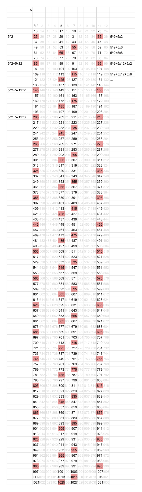
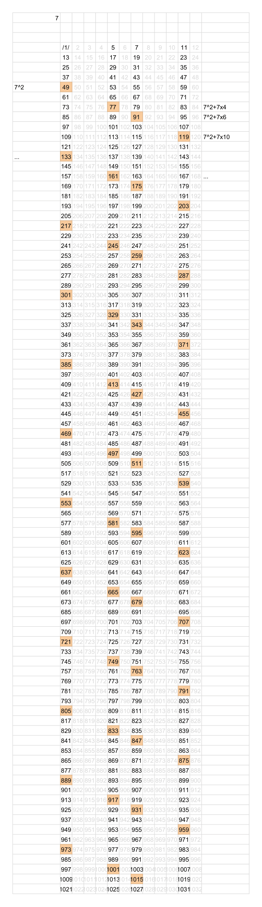
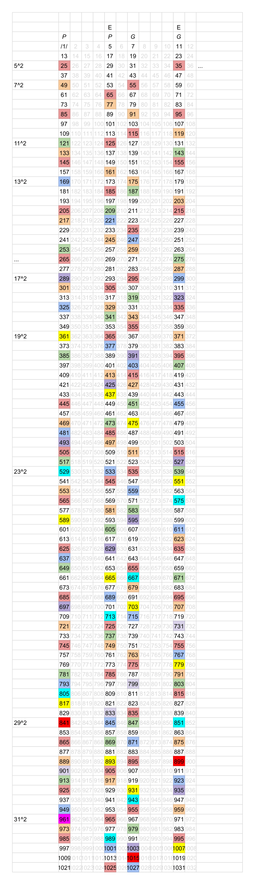

# Primes


*2021: written before git, first committed in 2026*

A small, self-guessed prime number generator in Python.

## How it works

Every prime greater than 3 leaves a remainder of 1, 5, 7, or 11 when divided by 12. `primes_rows` walks these four number lines at once (`row = [1, 5, 7, 11]`, each stepping by 12), and for each candidate checks it against a running list of known primes' future multiples — rather than testing divisibility directly. If a candidate matches one of those tracked "not-prime" values, it's composite and the tracker jumps ahead by `12 * prime`; otherwise it's prime, and it gets its own tracker seeded from its square.

## Usage

```bash
python primes.py
```

Prints all primes up to the limit set by `primes_rows(1020)` at the bottom of the file. Change that number to adjust the range.

## How this was found

Before any code existed, this was worked out by hand in a spreadsheet. Laying numbers 1 through 1000+ out in rows of 12 made a pattern visible immediately: every prime greater than 3 lands in one of only four columns. From there, tracking where each prime's multiples actually fell — by hand, cell by cell — revealed the exact offsets now hardcoded in `primes_rows`: `+2, +6, +8` times the prime for one pair of columns, `+4, +6, +10` for the other, repeating every 12× the prime.

The third sheet below ("All primes") colors every number each prime (5, 7, 11, 13...) predicts as composite, starting from that prime's own square — a hand-run, color-coded version of the exact algorithm the code now runs automatically.

**In the "All primes" sheet, the numbers left uncolored in those four columns are the primes themselves.**

*Legend: P = Pythagorean primes column, G = Gaussian primes column, E = Eisenstein primes (without imaginary part) column.*

| Prime of 5 | Prime of 7 | All primes |
|---|---|---|
| [](screenshots/sheet-5.png) | [](screenshots/sheet-7.png) | [](screenshots/sheet-all.png) |
